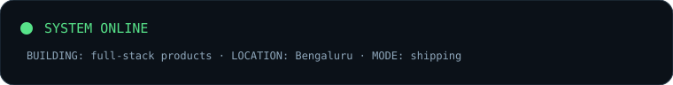
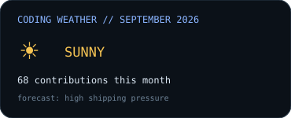
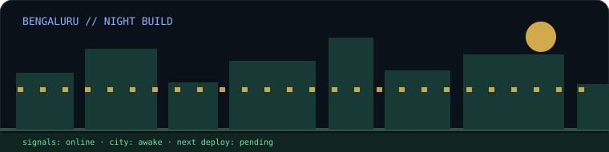
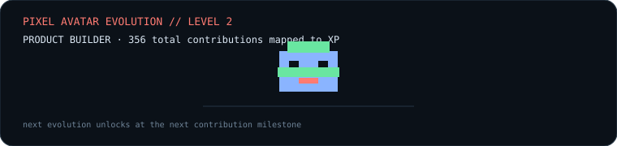

<div align="center">

# SHIVAM // FULL-STACK BUILDER



`TypeScript` · `React` · `Next.js` · `Node.js` · `PostgreSQL`

[Portfolio](https://www.justshivamm.in/) · [LinkedIn](https://www.linkedin.com/in/shivam-28bbb92ab) · [GitHub](https://github.com/shivam2931120)

</div>

## `profile.boot()`

```text
> location: Bengaluru, India
> mission: turn useful ideas into production systems
> strengths: clean UX · reliable APIs · auth · data modeling
> status: accepting internships and full-stack opportunities
```

## ⚡ LIVE SYSTEM STATUS






<details>
<summary>🛰️ Open the mission log</summary>
<br>

```text
[ OK ] frontend systems      React / Next.js
[ OK ] backend systems        Node.js / NestJS
[ OK ] data layer             PostgreSQL / Prisma / Supabase
[ OK ] deployment mindset     repeatable and production-ready
[ ?? ] next experiment        classified until shipped
```
</details>

## 🌱 COMMIT GARDEN

Every high-activity contribution becomes a pixel plant. The garden is regenerated daily from my GitHub contribution calendar and the plants gently move in the SVG.















## 🧪 PROJECT LAB

<table>
<tr><td width="50%">

### [Microservices Inventory](https://github.com/shivam2931120/microservice_inventory)
`NestJS` `React` `PostgreSQL` `Docker`

Inventory and order platform with service boundaries, RBAC, event workflows, metrics, and Kubernetes manifests.

</td><td width="50%">

### [Editorial](https://github.com/shivam2931120/realtime_collab)
`React` `TypeScript` `Socket.io` `Supabase`

Real-time document collaboration workspace with rich-text editing, roles, comments, versioning, exports, and socket sync.

</td></tr>
<tr><td>

### [SecureVault](https://github.com/shivam2931120/SecureVault)
`Next.js` `Web Crypto` `Supabase`

Zero-knowledge secure-data vault with client-side AES-GCM encryption and a production-style app shell.

</td><td>

### [Job Application Tracker](https://github.com/shivam2931120/Job-Application-Tracker)
`Manifest V3` `JavaScript` `HTML` `CSS`

Local-first browser extension for applications, reminders, notes, imports, and exports.

</td></tr>
</table>

<details>
<summary>📦 Load more projects</summary>
<br>

- [TheMovie](https://github.com/shivam2931120/TheMovie) — Next.js movie catalogue with auth, watchlists, ratings, and search.
- [Portfolio](https://github.com/shivam2931120/portfolio) — Next.js portfolio with deployment and visitor-counting support.
- [Printly](https://github.com/shivam2931120/Printly) — College printing service with uploads, pricing, checkout, and inventory processing.
- [Aviation Tracker](https://github.com/shivam2931120/aviation-tracker) — Flight reliability dashboard with route scoring and delay prediction.
- [Tab Manager Pro](https://github.com/shivam2931120/Tab-Manager-Pro) — Local-first browser extension for saving and restoring tab sessions.
- [Unix Utility Suite](https://github.com/shivam2931120/unix_mini_project) — Linux desktop toolkit built with C, Bash, Make, and Zenity.

</details>

## 🎮 UNLOCKABLES

<details>
<summary>⌨️ Konami protocol</summary>
<br>

Try the classic sequence on this page: **↑ ↑ ↓ ↓ ← → ← → B A**. GitHub READMEs cannot execute JavaScript, so this is an instruction-based Easter egg rather than a live key listener.
</details>

<details>
<summary>🐈 Do not inspect the source</summary>
<br>

```text
 /\_/\\
( o.o )   psst... ship something today
 > ^ <
```
</details>

<details>
<summary>🗺️ Skill tree</summary>
<br>

```text
PRODUCT BUILDING  █████████░ 90%
FRONTEND SYSTEMS  █████████░ 88%
BACKEND APIS      ████████░░ 80%
DATA MODELING     ███████░░░ 74%
DEVOPS            ██████░░░░ 61%
```
</details>

## 🔭 CURRENTLY FOCUSING ON

- Building production-style full-stack applications with clear architecture and deployment paths.
- Improving backend reliability with authentication, validation, observability, and repeatable setup.
- Shipping polished interfaces that are responsive, accessible, and easy to evaluate.

<div align="center">

### `> end transmission_`

</div>
