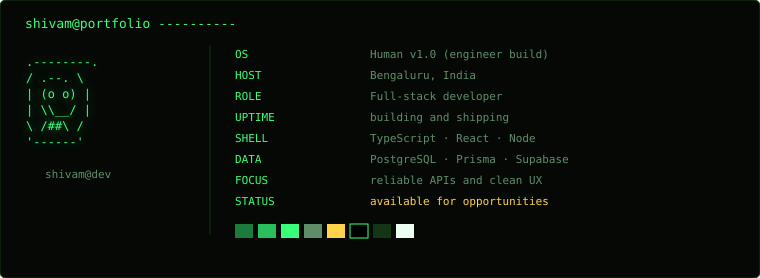

<div align="left">



```text
shivam@portfolio:~/dev $ whoami --full
```



```text
[x] location      Bengaluru, India
[x] stack         TypeScript / React / Next.js / Node.js
[x] data          PostgreSQL / Prisma / Supabase
[x] status        available for internships and full-stack roles
```

`$ ls ~/projects ->` &nbsp;&nbsp; [ `./contact --hire` ](https://www.justshivamm.in/)

```text
shivam@portfolio:~/dev $ neofetch
```



```text
shivam@portfolio:~/dev $ ls -la ~/projects  # 4 selected
```

## > selected work

<table>
<tr><td width="50%">

`-rwxr-xr-x` **[microservice_inventory/](https://github.com/shivam2931120/microservice_inventory)**

Inventory and order platform with service boundaries, RBAC, event workflows, metrics, Docker, and Kubernetes manifests.

`NestJS` `React` `PostgreSQL` `Docker`

[→ source](https://github.com/shivam2931120/microservice_inventory)

</td><td width="50%">

`-rwxr-xr-x` **[realtime_collab/](https://github.com/shivam2931120/realtime_collab)**

Real-time document collaboration workspace with rich-text editing, roles, comments, versioning, exports, and socket sync.

`React` `TypeScript` `Socket.io` `Supabase`

[→ source](https://github.com/shivam2931120/realtime_collab)

</td></tr>
<tr><td>

`-rwxr-xr-x` **[SecureVault/](https://github.com/shivam2931120/SecureVault)**

Zero-knowledge secure-data vault using client-side AES-GCM encryption and a production-style app shell.

`Next.js` `Web Crypto` `Supabase`

[→ source](https://github.com/shivam2931120/SecureVault)

</td><td>

`-rwxr-xr-x` **[Job-Application-Tracker/](https://github.com/shivam2931120/Job-Application-Tracker)**

Local-first Manifest V3 browser extension for applications, reminders, notes, imports, and exports.

`Manifest V3` `JavaScript` `HTML` `CSS`

[→ source](https://github.com/shivam2931120/Job-Application-Tracker)

</td></tr>
</table>

<details>
<summary>→ ls more projects</summary>
<br>

`[x]` [TheMovie](https://github.com/shivam2931120/TheMovie) · movie catalogue with auth, watchlists, ratings, and search<br>
`[x]` [Portfolio](https://github.com/shivam2931120/portfolio) · personal portfolio and visitor-counting support<br>
`[x]` [Printly](https://github.com/shivam2931120/Printly) · college printing service with uploads and checkout<br>
`[x]` [Aviation Tracker](https://github.com/shivam2931120/aviation-tracker) · flight reliability and route scoring dashboard<br>
`[x]` [Tab Manager Pro](https://github.com/shivam2931120/Tab-Manager-Pro) · local-first browser extension for saving and restoring tab sessions<br>
`[x]` [Unix Utility Suite](https://github.com/shivam2931120/unix_mini_project) · Linux utilities in C, Bash, Make, and Zenity

</details>

```text
shivam@portfolio:~/dev $ cat stack.txt | sort -r
```

## > proficiency

```text
TypeScript       [███████████████████░] 95%
React / Next.js   [██████████████████░░] 92%
PostgreSQL / SQL  [██████████████████░░] 90%
Node.js / NestJS  [████████████████░░░░] 86%
Python            [███████████████░░░░░] 78%
Docker / K8s      [██████████████░░░░░░] 72%
System design     [███████████████░░░░░] 76%
Design / UI       [██████████████░░░░░░] 70%
```

```text
shivam@portfolio:~/dev $ ./contact --hire
```



```text
shivam@portfolio:~/dev $ echo "(c) 2026 Shivam, built in the terminal, shipped fast"
last commit: live telemetry · main · uptime: 99.98% █
```

</div>
